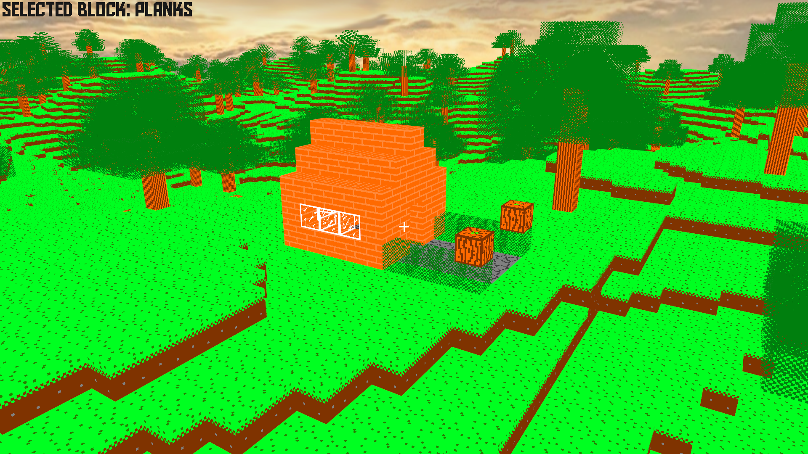

# Voxel-Engine
 A basic voxel engine made with C++17 and OpenGL 4.6.

 

## Controls
 **W**/**A**/**S**/**D**/**Controller d-pad**/**Controller left axis** - move.

 **Mouse motion**/**Controller right axis** - look around.

 **Left click**/**Left trigger** - destroy block.

 **Right click**/**Right trigger** - place block.

 **Scroll wheel**/**Controller shoulder buttons** - cycle through placeable blocks.

 **Left shift**/**Controller A button** - increase speed.

 **Space**/**L3** - display wireframe.

 **Escape**/**Start** - quit game.

 **F2** - take screenshot.

 ## Credits
 All textures made with [Paint.NET](https://www.getpaint.net/).

Skybox from [CustomMapMakers](http://www.custommapmakers.org/skyboxes.php).

 All sound effects make with [as3sfxr](https://www.superflashbros.net/as3sfxr/).

 All fonts from [dafont](https://www.dafont.com/aldo-the-apache.font).

 ## Dependencies
 [SDL2](https://www.libsdl.org/index.php) - for window creation, input handling and OpenGL context creation.

 [OpenGL](https://www.opengl.org/) - for 3D graphics.

 [GLAD](https://glad.dav1d.de/) - for accessing modern OpenGL functions.

 [GLM](https://glm.g-truc.net/0.9.9/index.html) - for linear algebra and other graphical mathematics.

 [STB Image](https://github.com/nothings/stb) - for loading to/writing from image files.

 [OpenAL Soft](https://github.com/kcat/openal-soft) - for 3D audio.

 [FreeType](https://www.freetype.org/) - for converting TTF files into texture atlases to be rendered.

 [tinyxml2](https://github.com/leethomason/tinyxml2) - for reading XML files.

 [magic_enum](https://github.com/Neargye/magic_enum) - for static reflection of enums.